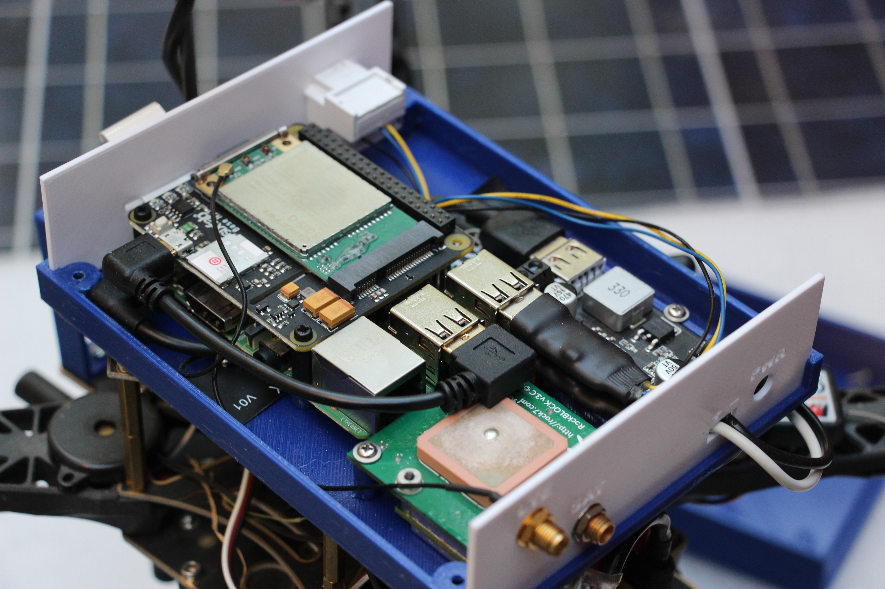

# UV RadioRoom with Raspberry PI 3 and RockBLOCK 9603

See [enclosure1](enclosure1) folder for the STL files of the 3D printed enclosure.

# Bill of Materials

|Part Name|Quantity|
|---------|--------|
|[Raspberry Pi 3 Model B+](https://www.raspberrypi.org/products/raspberry-pi-3-model-b-plus/)|1|
|[RockBLOCK 9603](https://www.rock7.com/products/rockblock-9603-compact-plug-play-satellite-transmitter)|1|
|[DROK 5A USB Voltage Regulator DC 9V-36V](https://www.droking.com/Power-Supply-Module-DC-9V-36V-to-5.2V-5A-Double-Output-Buck-Converter-USB-Charger-Voltage-Regulator-Adapter-Driver-Module)|1|
|[Short FTDI USB Serial Cable for RockBLOCK 9603](https://www.amazon.com/Short-FTDI-Serial-Cable-RockBLOCK/dp/B08CXMQ1Y9)|1|
|[TTL-232R-3V3-PCB](https://www.digikey.com/en/products/detail/ftdi-future-technology-devices-international-ltd/TTL-232R-3V3-PCB/1836396)|1|
|[Sixfab Raspberry Pi 4G/LTE Cellular Modem Kit - Quectel EG25-G (Global)](https://sixfab.com/product/raspberry-pi-4g-lte-modem-kit/)|1|
|6 Inches - 90 Degree USB to Micro USB Cable|1|
|Tails cable with 6 pin DF13 series connector|1|
|Self Tapping Screws M2.5 8mm|10|
|Self Tapping Screws M2.5 6mm|2|
|PETG or PLA filament|120g|
